

  

  <h1 align="center">MYNOVA-SmartPower</h1>

English | [简体中文](README_zh-CN.md) | [日本語](README_ja-JP.md)

# Introduction

This is an open-source hardware project aimed at creating an intelligent power extraction box for DELL server PSUs. It controls power switching, reads voltage, current, power values, and temperature inputs and displays them on an OLED screen. The device outputs 12V power through DC5.5 and XT60 interfaces for standard 12V devices.

The open-source project includes firmware code for the chip, web-based application code, circuit schematics (Altium Designer and PADS), and PCB Gerber files. Additionally, 3D files of the casing are provided for 3D printing.

Completed product can be seen in the following image:

  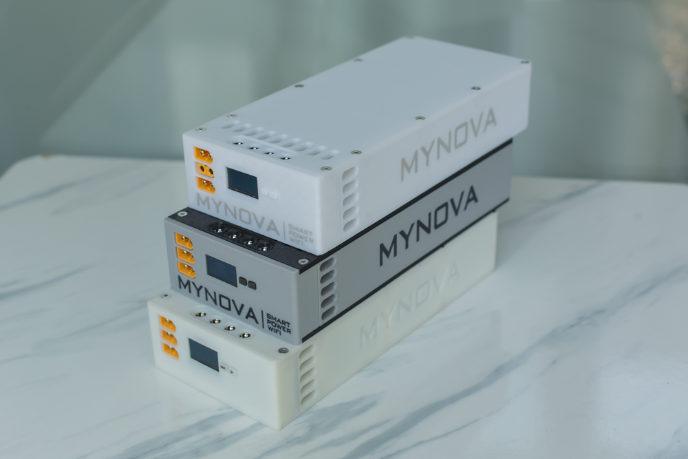
  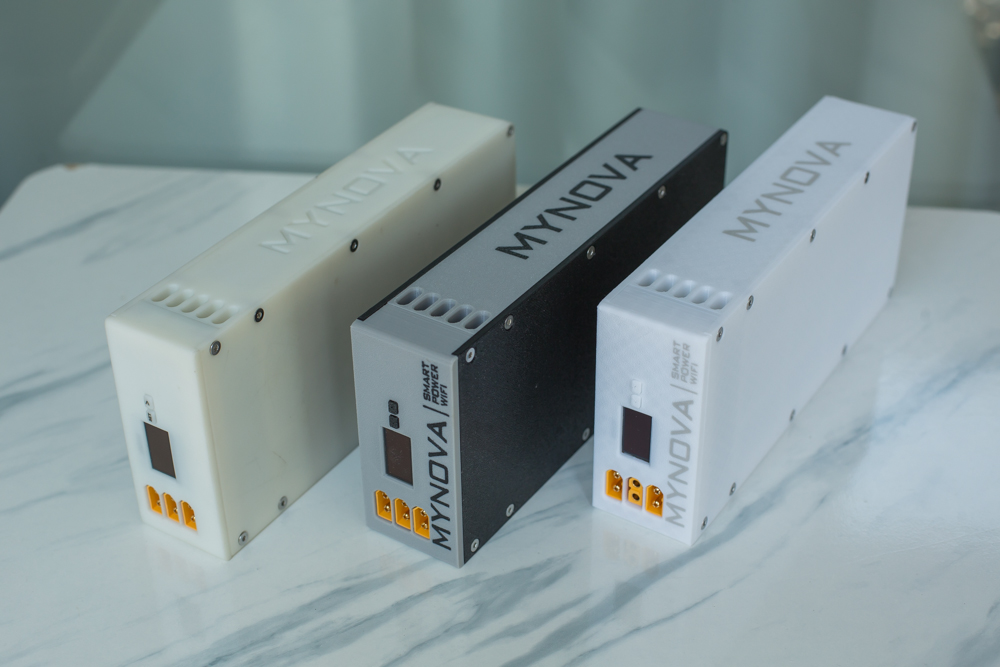

  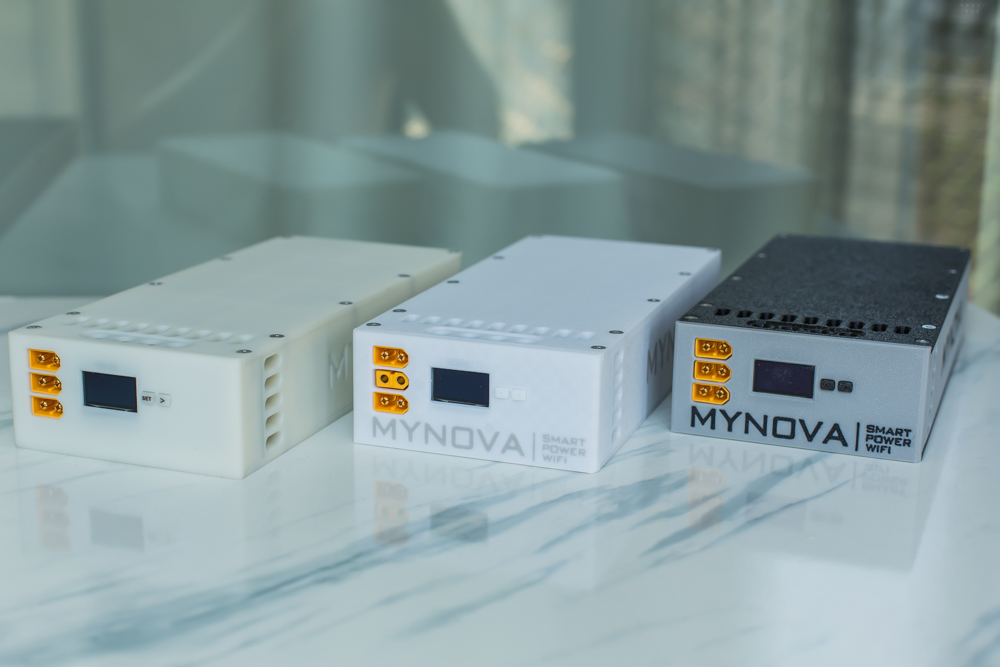
  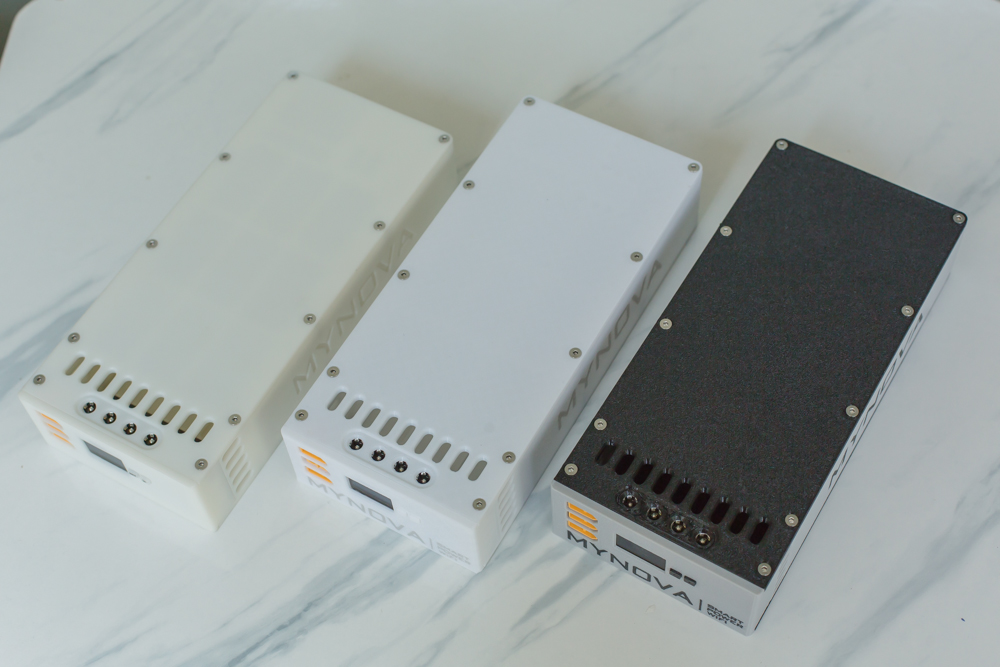

  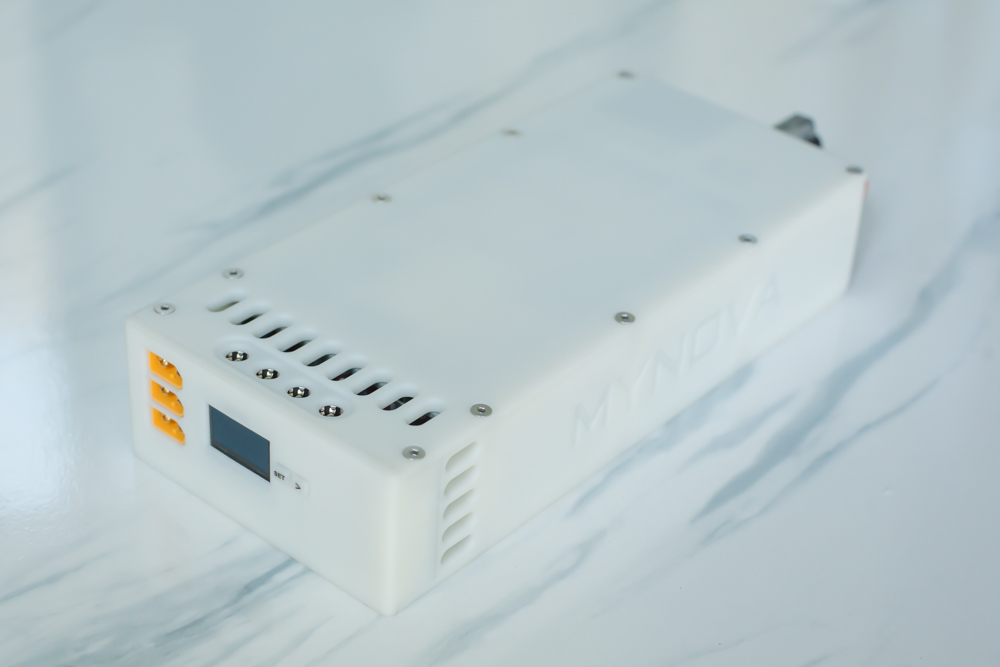
  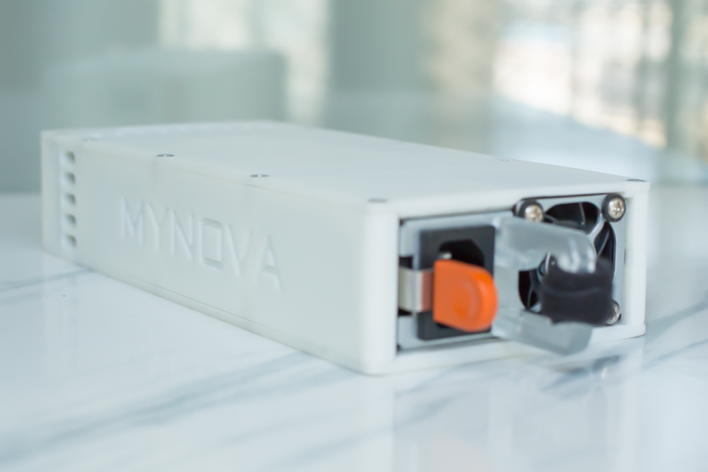

  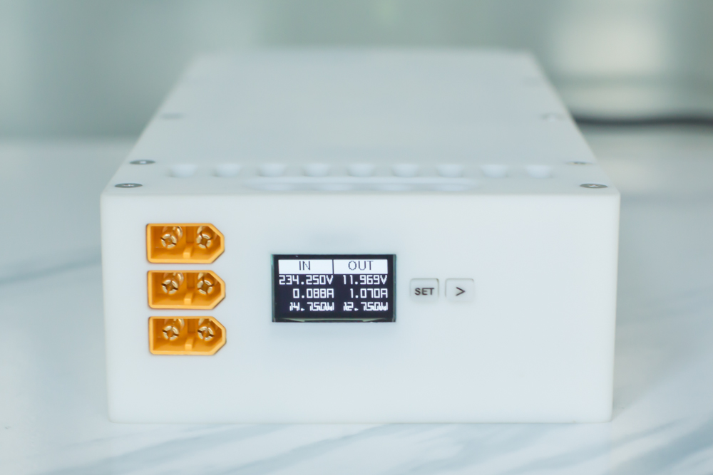
  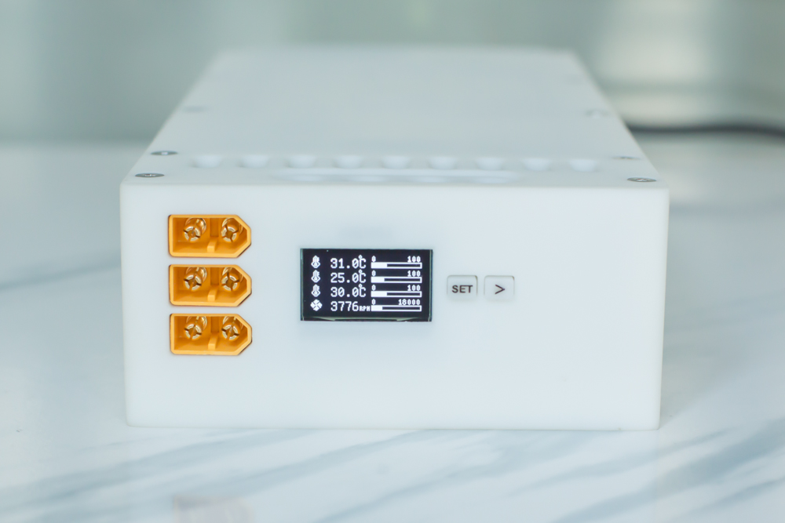

  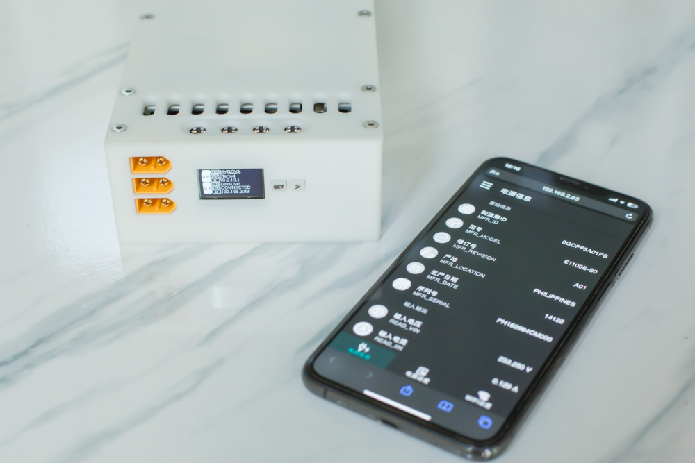
  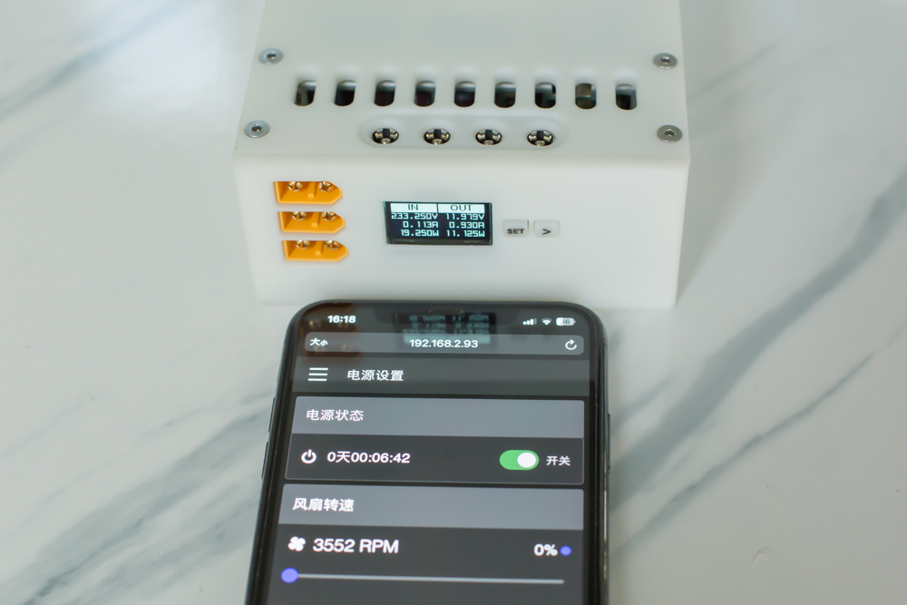

## Features

- Control power on and off.
- Read and display input, output voltage, current, and power values.
- Read power supply temperature.
- Set fan speed (currently ineffective, overridden by the PSU itself).
- WiFi connectivity to view data via web interface by entering IP on mobile or computer.
- Control power on and off via web interface.

## Supported Chips

- ESP32-S3-WROOM-N16
- ESP32-S3-WROOM-N8

Or chips from the ESP32-S3 series. Depending on flash capacity of the chip, define partition table before download firmware.

## Tested PSU

This firmware has been tested on the following DELL PSU models:
- E750E-S0
- E1100E-S0
- L1100E-S0
- D2000E-S2(EPP)

Other models should be similar; further testing required as I lack additional models.

## Directory Structure

- MYNOVA_POWER: Firmware code for the chip.
- ESPVue: Web-related application code.
- partitions: Partition table files.
- Hardware: Hardware datasheet, including circuit schematics, design files for Altium Designer and PADS, as well as PCB Gerber files.
- 3DModels: 3D model files for the casing, including STL and editable STEP files.

## Compilation Environment

- Firmware: Arduino IDE 1.8.19
- Web: Node.js v20.15.1

## Firmware Dependencies

- Install ESP32 official development board (recommended V2.0.11 to avoid compilation failures).
- Install U8g2lib.
- Install ESPAsyncWebServer server component.
- Install ArduinoJson library.
- Install ESP32TimerInterrupt library.

## Firmware Flashing Method

1. Depending on the flash size of your ESP32-S3 chip (16MB or 8MB), download the corresponding bin file from the [Release](https://github.com/Tomosawa/MYNOVA-SmartPower/releases) page.
2. Download the official [flash download tools](https://www.espressif.com/en/support/download/other-tools) or use the [esptool.py](https://github.com/espressif/esptool) command line tool.
3. Select the corresponding bin firmware file, set the flashing offset address to 0x0000, and start the flashing process.

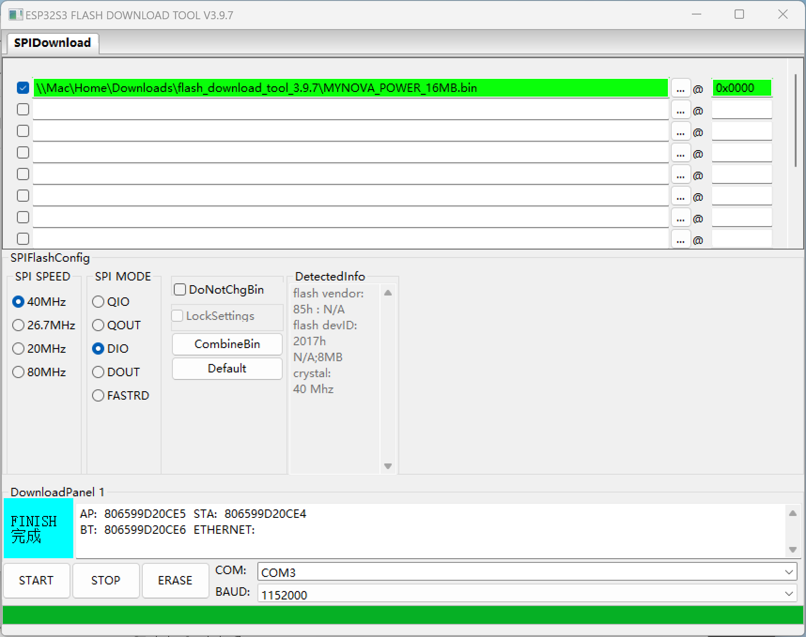

## Contribution Guidelines

Contributions to this project are welcome. Please follow these guidelines:
- Fork the repository and create your feature branch.
- Commit your changes and push to your fork.
- Submit a Pull Request.

## Copyright Statement

This project is prohibited for any commercial use and is intended for learning and DIY purposes only.

## License [LICENSE](LICENSE)

This project is licensed under the [GPLv3](LICENSE). [GPLv3 (GNU General Public License version 3)](LICENSE) is a free, open-source software license that guarantees users the freedoms to run, study, share, and modify the software.
The complete text of the [GPLv3](LICENSE) license is included in the [LICENSE](LICENSE) file of this project. Before using, modifying, or distributing the code of this project, make sure you have read and understood the entire [GPLv3](LICENSE) license.

## Acknowledgments

- [Multibutton](https://github.com/0x1abin/MultiButton)