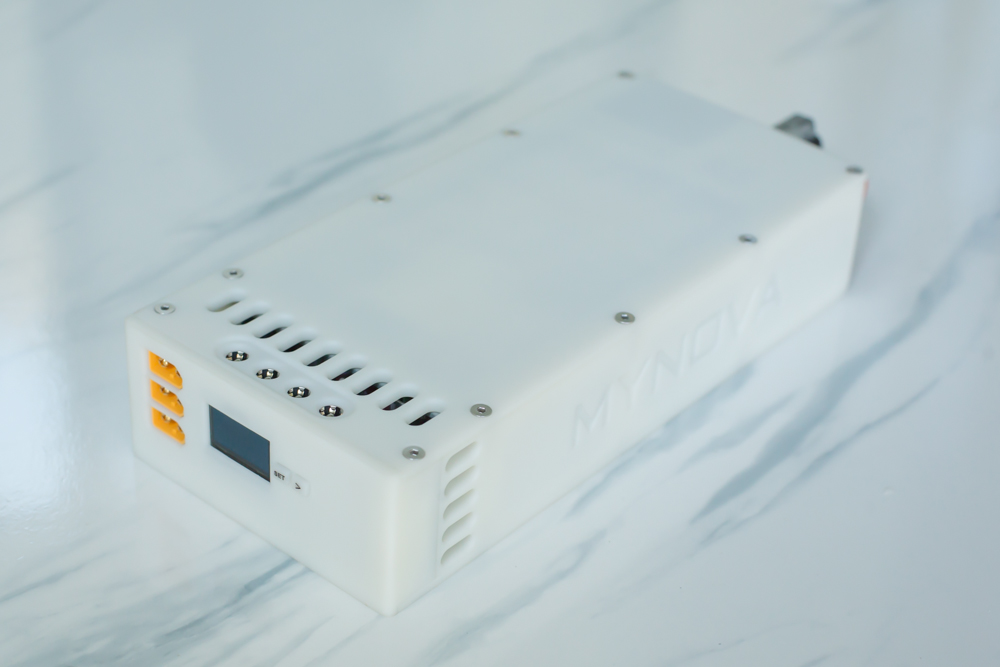
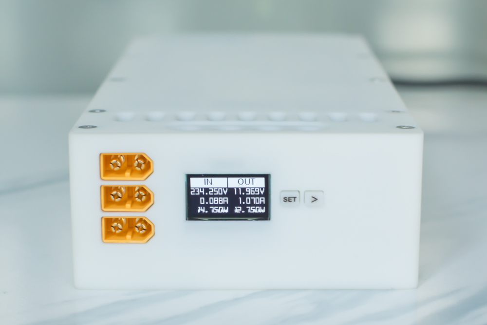

  

  <h1 align="center">MYNOVA-SmartPower</h1>

[English](README.md) | [简体中文](README_zh-CN.md) | 日本語

# 概要

このプログラムファームウェアは、DELLサーバーのPSU（電源装置）を管理し、関連するPMBusパラメータを読み取り、DC5.5およびXT60インターフェースを通じて12V電力を出力するインテリジェントな電力抽出装置のファームウェアプログラムです。このプログラムには、チップのファームウェアコードとWebベースのアプリケーションコードが含まれています。

完成品のイメージは以下の通りです：

<figure>

</figure>

## 機能概要

- 電源のオン/オフの制御
- 入力および出力電圧、電流、電力の読み取りと表示
- 電源の温度の取得
- ファンの回転数の設定（現時点では電源によって上書きされます）
- WiFi接続が可能で、IPを入力してWebページから閲覧可能
- Webページを通じて電源のオン/オフの制御

## 対応チップ

- ESP32-S3-WROOM-N16
- ESP32-S3-WROOM-N8

またはESP32-S3シリーズ関連のチップ。チップのFlash容量に応じて、適切なパーティションテーブルを定義してから書き込んでください。

## テスト済み電源

このファームウェアは以下のDELL電源でテスト済みです：
- E750E-S0
- E1100E-S0
- D2000E-S2(EPP)

他のモデルも同様ですが、手元にこれ以上のモデルがないため、ご自身でのテストをお願いします。

## ディレクトリ構成

- MYNOVA_POWER： チップ用のファームウェアコード
- ESPVue： Web関連のプログラムコード
- partitions： パーティションテーブルファイル

## コンパイル環境

- ファームウェア： Arduino IDE 1.8.19
- Webアプリケーション： Node.js v20.15.1

## ファームウェアのコンパイル依存関係

- ESP32公式開発ボードのインストール（V2.0.11を推奨、それ以外の場合はコンパイルエラーが発生する可能性があります）
- U8g2libのインストール
- ESPAsyncWebServerのインストール
- ArduinoJsonライブラリのインストール
- ESP32TimerInterruptライブラリのインストール

## 貢献ガイドライン

このプロジェクトへの貢献を歓迎します。以下のガイドラインに従ってください：
- このリポジトリをForkし、特性ブランチを作成してください。
- 変更をコミットし、Forkしたリポジトリにプッシュしてください。
- Pull Requestを提出してください。

## 著作権表示

このプロジェクトは商業目的には使用できず、学習およびDIY目的にのみ使用できます。

## ライセンス [LICENSE](LICENSE)

このプロジェクトは[GPLv3](LICENSE)ライセンスで提供されています。[GPLv3（GNU General Public License version 3）](LICENSE)は、自由かつオープンソースのソフトウェアライセンスであり、ユーザーがソフトウェアを実行、学習、共有、および変更する自由を保証します。
完全な[GPLv3](LICENSE)ライセンステキストは、このプロジェクトの[LICENSE](LICENSE)ファイルに含まれています。このプロジェクトのコードを使用、変更、または配布する前に、GPLv3ライセンスの内容を理解し、了解したことを確認してください。

## 謝辞

- [Multibutton](https://github.com/0x1abin/MultiButton)
