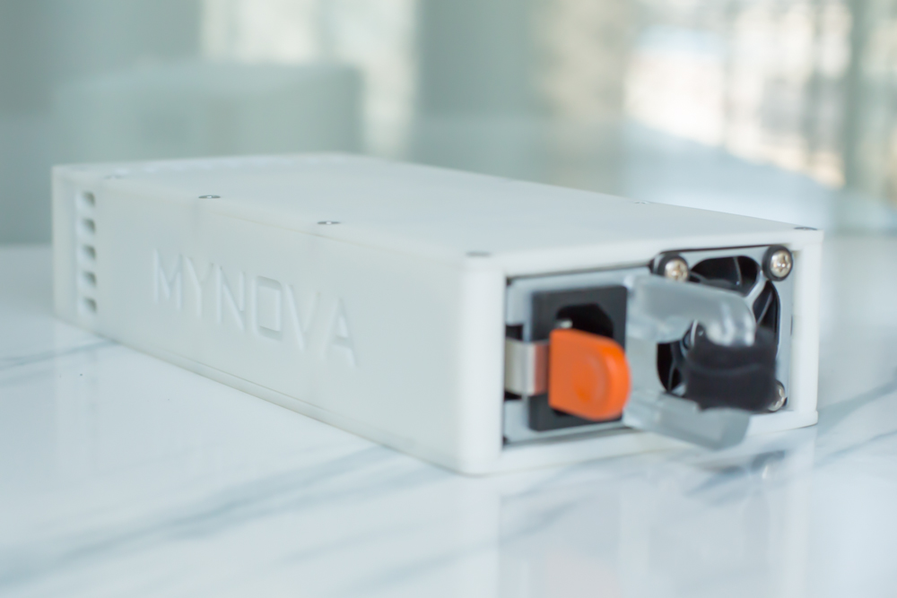
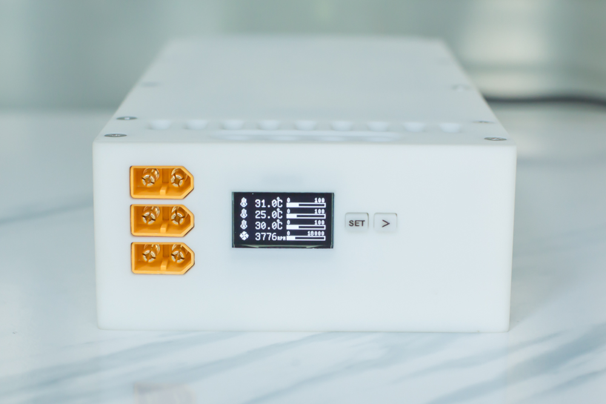
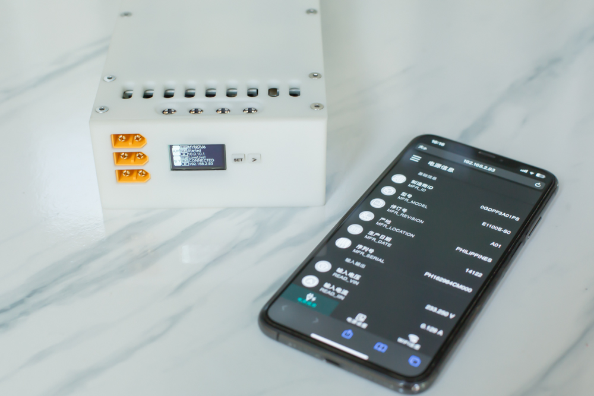

  

  <h1 align="center">MYNOVA-SmartPower</h1>

[English](README.md) | 简体中文 | [日本語](README_ja-JP.md)

# 简介

这是一个适用于DELL服务器PSU电源的智能取盒的程序固件程序。程序包含芯片的固件程序代码，和Web端的程序代码。

制作好的成品见下图：

<figure>

</figure>

## 功能介绍

- 控制电源的开和关
- 读取和显示电源的输入、输出的电压、电流、功率值
- 读取电源温度
- 设定风扇转速（暂时无效，会被电源本身改写覆盖）
- 可连接WIFI，通过手机或电脑输入IP后在Web页面查看
- 通过Web页面控制电源的开和关

## 适用芯片

- ESP32-S3-WROOM-N16
- ESP32-S3-WROOM-N8

或者S3相关系列的芯片。根据芯片Flash容量的大小，请自行定义好分区表后烧录。

## 测试电源

本程序在DELL的以下型号电源测试通过：
- E750E-S0
- E1100E-S0
- D2000E-S2(EPP)

其它型号也类似，由于我手头没有更多的型号了，所以请大家自行测试。

## 目录说明

- MYNOVA_POWER： 芯片中的固件程序代码
- ESPVue： Web相关的程序代码
- paritions：分区表文件

## 代码编译环境

- 固件程序：Arduino IDE 1.8.19
- Web程序：Node.js v20.15.1

## 固件编译依赖

- 安装ESP32官方的开发板（推荐V2.0.11否则会编译失败）
- 安装U8g2lib
- 安装ESPAsyncWebServer服务器组件
- 安装ArduinoJson库
- 安装ESP32TimerInterrupt库

## 贡献指南

欢迎对本项目进行贡献，请遵循以下指南：
- Fork本仓库并创建你的特性分支。
- 提交你的更改并推送到你的Fork。
- 提交Pull Request。

## 版权声明

本项目禁止用于任何商业用途、仅供学习和自己DIY使用。

## 许可证 [LICENSE](LICENSE)

本项目采用[GPLv3](LICENSE)许可证。[GPLv3（GNU General Public License version 3）](LICENSE)是一个自由、开源的软件许可证，它保证了用户运行、学习、分享和修改软件的自由。
完整的[GPLv3](LICENSE)许可证文本包含在本项目的[LICENSE](LICENSE)文件中。在使用、修改或分发本项目的代码之前，请确保你已阅读并理解了[GPLv3](LICENSE)许可证的全部内容。

## 鸣谢

- [Multibutton](https://github.com/0x1abin/MultiButton)

